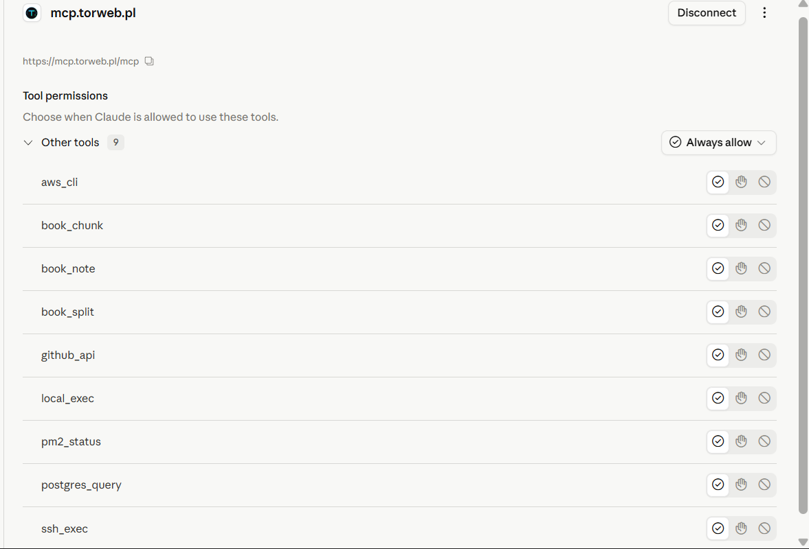
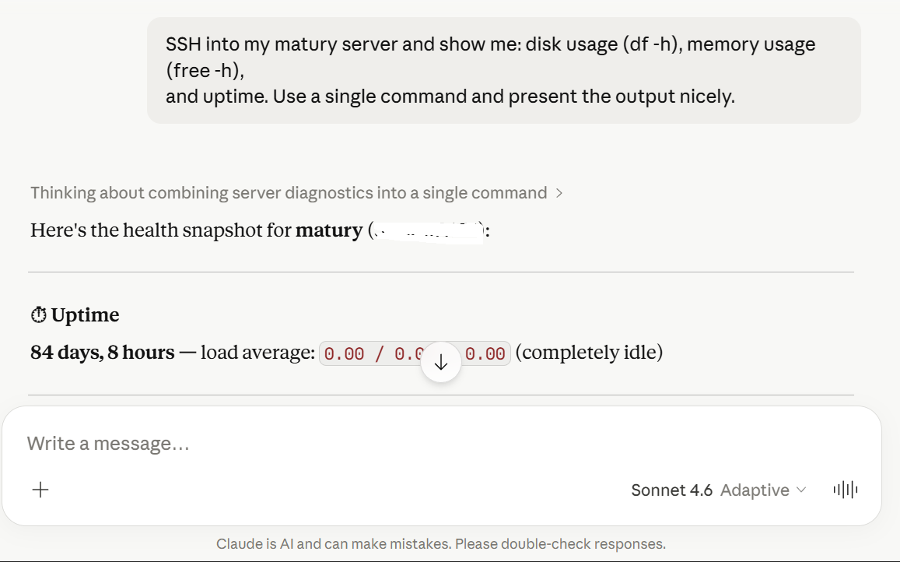
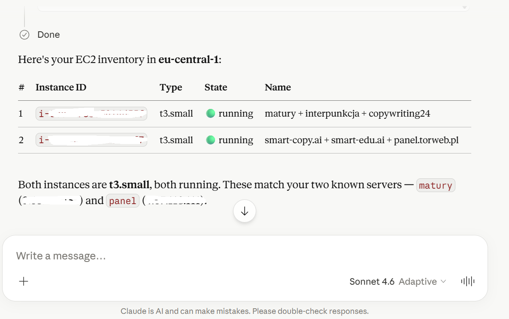
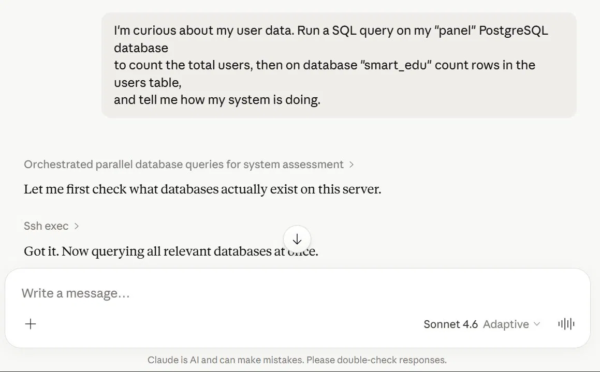
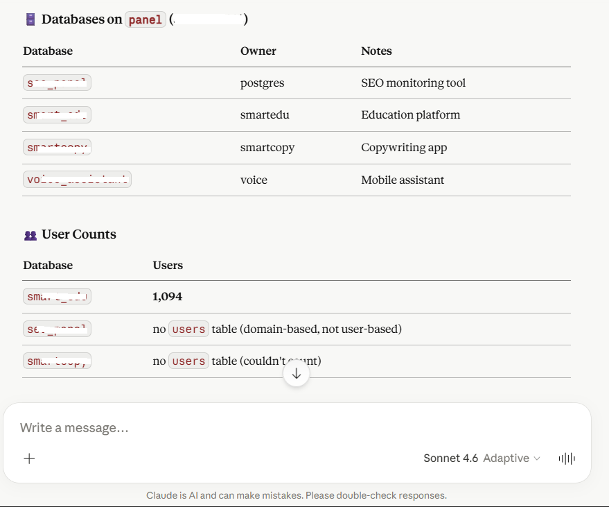

# mcp-server

> **Self-hosted MCP server for Claude.ai**
>
> Give Claude direct access to your AWS account, SSH into your servers, run shell commands on your laptop, query your databases, and manage PM2 processes — all from a Claude chat. **No Claude Code subscription needed. Your keys never leave your machine.**



_All 10 tools live in your Claude.ai sidebar - no Desktop install, no separate client, just a custom connector._

[](https://github.com/LeszczynskiKarol/mcp-server/actions/workflows/ci.yml)
[](LICENSE)
[](https://nodejs.org/)
[](https://modelcontextprotocol.io/)

---

## What is this?

A small Node.js MCP server you run on your own machine (laptop, desktop, VPS) and connect to **Claude.ai** (or any MCP client) as a Custom Connector. It exposes a configurable set of tools that let Claude do real work on your infrastructure:

- Run AWS CLI commands using your local profile
- SSH into your servers using your `.pem` keys
- Execute shell commands on your local machine
- Write files directly on your local disk (full UTF-8, no shell quoting)
- Hit the GitHub REST API with your Personal Access Token
- Query PostgreSQL databases on remote hosts via SSH
- Inspect PM2 processes on remote servers
- Iterate over very long documents (book editing) that exceed the context window

**Architecture:**

```
  Claude.ai  ──HTTPS──►  nginx + cert  ──HTTP──►  frps  ──tunnel──►  frpc + node
   (cloud)               on a VPS         :8080    (vhost)            (your PC)
                                                                          │
                                ┌───────────────┬───────────────┬─────────┼─────────┐
                                ▼               ▼               ▼         ▼         ▼
                            AWS CLI       ssh -i *.pem      cmd.exe    psql via   pm2 list
                            (local)       user@host         git/npm      SSH      (remote)
```

SSH keys, GitHub PAT and AWS credentials **never leave your local machine**. The tunnel only carries MCP requests and their results.

---

## Why self-host this?

The MCP ecosystem mostly does two things today:

1. **MCP servers as npm packages** that run via `stdio` and require Claude Desktop.
2. **Hosted MCP services** behind someone else's auth and API limits.

This project is the **third option**: your own MCP server, your keys, your servers, accessible from web Claude.ai (where you already work). It's a single ~1000-line `server.js` file that you can read end-to-end in 20 minutes and extend in 5.

**Killer features:**

- ✅ **No Claude Code subscription needed** — works with regular Claude.ai (web)
- ✅ **OAuth 2.1 with PKCE** — proper Claude.ai integration, not a hacky workaround
- ✅ **Your keys stay yours** — SSH keys, GitHub PATs, AWS creds never leave your machine
- ✅ **Self-hostable** — Windows, Linux, Mac, anything that runs Node 18+
- ✅ **Configurable via JSON** — add a new server or new key without touching code
- ✅ **One file to read** — no framework magic, no hidden config
- ✅ **Hardened OAuth** — PKCE S256, `client_secret` enforcement, refresh token rotation, RFC 7009 revocation, dynamic IP allowlist with auto-enroll, anti-clickjacking

---

## Tools

| Tool             | What it does                                                                                                                                               |
| ---------------- | ---------------------------------------------------------------------------------------------------------------------------------------------------------- |
| `aws_cli`        | Run any `aws <command>` using your local AWS CLI profile                                                                                                   |
| `ssh_exec`       | SSH into any host using a key defined in `hosts.json`                                                                                                      |
| `local_exec`     | Run any shell command on the local machine (`cmd.exe` on Windows, `/bin/sh` elsewhere)                                                                     |
| `write_file`     | Write text content to a local file (overwrite or append). Full UTF-8, no shell quoting issues — preferred over `local_exec` for any non-trivial file write |
| `github_api`     | Make REST API requests to GitHub using your Personal Access Token                                                                                          |
| `postgres_query` | Run `psql` queries via SSH (`sudo -u postgres`) on a host from `hosts.json`                                                                                |
| `pm2_status`     | Show `pm2 list` and optional logs on a remote server                                                                                                       |
| `sftp_download`  | Stream a file from a remote host to the local filesystem (uses the persistent SSH pool). Essential when working from Claude.ai web — the cloud sandbox has no native scp |
| `sftp_upload`    | Stream a local file to a remote host. Optional POSIX mode flag (e.g. `0755`). Parent dir must exist on remote                                              |
| `book_split`     | Split a large text file into ~3000-word chunks                                                                                                             |
| `book_chunk`     | Read one chunk from a directory created by `book_split`                                                                                                    |
| `book_note`      | Manage JSON notes for iterative work on long documents                                                                                                     |

---

## See it in action

Real examples from a real Claude.ai chat using this MCP server.

### Server health snapshot over SSH

> _"SSH into my matury server and show me: disk usage (df -h), memory usage (free -h), and uptime. Use a single command and present the output nicely."_



Claude composes a single SSH command, parses the multi-section output, and renders disk, memory and uptime as a clean snapshot with key numbers highlighted.

### List EC2 instances in any region

> _"Using AWS CLI, list all my EC2 instances in eu-central-1 with their IDs, types, and state. Format the result as a clean table."_



Claude calls `aws_cli` with a `describe-instances --query ...` filter, then parses the JSON and renders it as a markdown table with running/stopped status indicators.

### Query PostgreSQL databases over SSH

> _"Run a SQL query on my 'panel' PostgreSQL database to count the total users, then on database 'smart_edu' count rows in the users table, and tell me how my system is doing."_



Two tools work together here: `ssh_exec` to enumerate databases when the first guess misses, then `postgres_query` against the right one.



Claude lists every database on the host, identifies the ones with a `users` table, and runs `COUNT(*)` queries in parallel.

---

## Requirements

- **Node.js 18+** (tested on 22, 24, 25)
- **SSH `.pem` keys** locally (for hosts you want to control)
- **AWS CLI configured locally** (`aws configure`) — only if you use the `aws_cli` tool
- **A public HTTPS endpoint** — only if you want to expose this to Claude.ai

---

## Quick start

```bash
git clone https://github.com/LeszczynskiKarol/mcp-server.git
cd mcp-server
npm install
cp .env.example .env                # fill in MCP_PASS and MCP_BASE_URL
cp hosts.example.json hosts.json    # add your servers
node server.js
```

You should see:

```
Loaded N hosts and M keys from ./hosts.json
MCP server: my-mcp-server
Port: 4500
Static IP allowlist: (none)
Auto-enroll: enabled (TTL 30 days)
Trust proxy: false
MCP listening on :4500
```

That's it for local. To use this from Claude.ai (web), you need to expose it over HTTPS — see [Exposing publicly](#exposing-publicly-claudeai) below.

---

## Configuration

### `.env` (secrets — never commit)

```env
# REQUIRED
MCP_USER=admin
MCP_PASS=<long password, min 20 chars>
MCP_BASE_URL=https://your-domain.com

# OPTIONAL — GitHub integration
GITHUB_TOKEN=github_pat_xxxxxxxxxxxxxxxx
GITHUB_OWNER=YourGitHubUsername

# OPTIONAL — server tuning
PORT=4500
TOKEN_TTL_SECONDS=2592000      # 30 days
AUTH_CODE_TTL_SECONDS=600      # 10 minutes
CLIENT_TTL_SECONDS=7776000     # 90 days (unused-client cleanup)
EXEC_BUFFER_MB=10
EXEC_TIMEOUT_SECONDS=120       # per-command timeout
MCP_SERVER_NAME=my-mcp-server
HOSTS_CONFIG=./hosts.json
OAUTH_STATE_FILE=./oauth-state.json

# OPTIONAL — IP allowlist (security)
# Comma-separated static IPs/CIDRs that are always allowed.
# Leave empty if you only want auto-enroll via OAuth login.
MCP_ALLOWED_IPS=
# Trust X-Forwarded-For — use "loopback" when behind FRP/nginx on the same box.
# Other valid values: comma-separated list of trusted proxy IPs/CIDRs, "false"
# (default), or "true" (rejected in production — would let any client spoof XFF).
MCP_TRUST_PROXY=loopback
# Auto-enroll the requesting /24 subnet to allowlist after a successful OAuth login
MCP_AUTO_ENROLL=true
# How long an auto-enrolled subnet stays on the allowlist (default 30 days)
MCP_ENROLL_TTL_SECONDS=2592000
```

### `hosts.json` (server list — never commit)

```json
{
  "hosts": {
    "production": {
      "ip": "1.2.3.4",
      "user": "ubuntu",
      "key": "main",
      "description": "Main production server"
    },
    "staging": {
      "ip": "5.6.7.8",
      "user": "ubuntu",
      "key": "main",
      "description": "Staging environment"
    }
  },
  "keys": {
    "main": "/path/to/main.pem"
  }
}
```

Key paths can use:

- Absolute paths: `D:/keys/server.pem` or `D:\\keys\\server.pem`
- Tilde expansion: `~/keys/server.pem` (resolved to `$HOME` / `%USERPROFILE%`)
- Forward slashes work on Windows too

---

## Exposing publicly (Claude.ai)

Claude.ai requires HTTPS. The recommended setup uses **FRP** (Fast Reverse Proxy) + **nginx** + **Let's Encrypt** on a small VPS.

### 1. DNS record

```
mcp.your-domain.com    A    <VPS_IP>    TTL 300
```

### 2. nginx vhost on VPS

`/etc/nginx/sites-available/mcp.your-domain.com`:

```nginx
server {
    server_name mcp.your-domain.com;
    location / {
        proxy_pass http://127.0.0.1:8080;
        proxy_set_header Host $host;
        proxy_set_header X-Real-IP $remote_addr;
        proxy_set_header X-Forwarded-For $proxy_add_x_forwarded_for;
        proxy_set_header X-Forwarded-Proto $scheme;

        # SSE / long-lived MCP connections
        proxy_http_version 1.1;
        proxy_set_header Connection "";
        proxy_buffering off;
        proxy_read_timeout 3600s;
        proxy_send_timeout 3600s;
    }
    listen 80;
}
```

```bash
sudo ln -s /etc/nginx/sites-available/mcp.your-domain.com /etc/nginx/sites-enabled/
sudo nginx -t && sudo systemctl reload nginx
sudo certbot --nginx -d mcp.your-domain.com
```

### 3. FRP server (`frps`) on VPS

`/etc/frp/frps.toml`:

```toml
bindPort = 7000
vhostHTTPPort = 8080
auth.method = "token"
auth.token = "<shared token>"
```

### 4. FRP client (`frpc`) on your local machine

`frpc-mcp.toml`:

```toml
serverAddr = "<VPS_IP>"
serverPort = 7000
auth.method = "token"
auth.token = "<shared token from frps>"

[[proxies]]
name = "mcp"
type = "http"
localPort = 4500
customDomains = ["mcp.your-domain.com"]
```

### 5. Add the connector in Claude.ai

1. Open **Settings → Connectors → Add custom connector**
2. URL: `https://mcp.your-domain.com/mcp` (with `/mcp` suffix!)
3. OAuth Client ID/Secret: **leave empty**
4. Click **Connect** → a login form appears → enter `MCP_USER` and `MCP_PASS` from your `.env`
5. In a chat: `+` → Connectors → toggle this MCP on → **start a new conversation** (tools attach at chat start)

The first request from a new IP will trigger an OAuth re-login, which adds your `/24` subnet to the allowlist for 30 days. This is intentional — see [Security](#security).

---

## Recommended Claude.ai preferences

Even with the right tools installed, Claude will sometimes waste tokens on common failure modes: re-reading files after writing them, copying files into the sandbox "to edit them", lying that a file is on disk when only an artifact was created.

[`CLAUDE_PREFERENCES.md`](CLAUDE_PREFERENCES.md) is a curated set of user preferences that closes those holes. Paste them into **Settings -> Profile -> Personal preferences** in [Claude.ai](https://claude.ai/settings/profile). They're battle-tested against the exact failure modes that prompted writing some of the tools in this server (especially `write_file`).

Covers, among other things:

- File-tool hierarchy: always `write_file` for new files, PowerShell for surgical edits, never base64-chunks through cmd.exe
- "Trust the write" -- don't re-read a file just to confirm it saved
- Sandbox isolation -- the bash sandbox has no access to your local disk; don't bridge it via public file hosts (uguu.se, transfer.sh, etc.)
- Artifacts vs. MCP file writes -- "Created a file" tiles in the chat UI are NOT saved to your disk
- Raw content rule -- `write_file` content must be raw, not JSON-escaped
- Anti-loop limits -- stop after 3 failures on the same problem
- Non-ASCII character handling on Windows (`cmd.exe` code page gotcha)

---
## Running on Windows

The recommended autostart on Windows uses **Task Scheduler** + a small `.bat` with a restart loop. PM2 used to be the recommendation but is currently incompatible with Node 25's named-pipe handling (`EPERM \\.\pipe\rpc.sock`), so the project has switched to plain Task Scheduler.

### One-shot install

After `.env` and `hosts.json` are in place, run as administrator:

```cmd
install-task.bat
```

This is a small batch wrapper around `install-task.ps1`. The PowerShell script:

1. Generates `start-mcp-hidden.vbs` (so the `cmd.exe` window stays hidden).
2. Generates `mcp-task.generated.xml` with `%USERDOMAIN%\%USERNAME%` filled in — nothing hard-coded.
3. Registers a Task Scheduler entry named **MCP Server** that runs at every logon with `HighestAvailable` privilege.

The action of the task is `wscript.exe "...\start-mcp-hidden.vbs"`, which silently launches `start-mcp.bat`. That batch keeps node alive with a restart loop:

```bat
@echo off
cd /d D:\mcp-server
if not exist logs mkdir logs
:loop
node server.js >> logs\mcp.log 2>&1
echo [%date% %time%] node exited, restarting in 5s >> logs\mcp.log
timeout /t 5 /nobreak >nul
goto loop
```

Useful commands:

```cmd
schtasks /run /tn "MCP Server"            :: start now
schtasks /query /tn "MCP Server" /v /fo LIST  :: status
schtasks /delete /tn "MCP Server" /f      :: uninstall
tasklist | findstr node.exe               :: check that node is alive
type D:\mcp-server\logs\mcp.log           :: read the log
```

To restart after editing `server.js`:

```cmd
taskkill /F /IM node.exe /T
```

The `:loop` in `start-mcp.bat` will restart node within 5 seconds.

### FRP tunnel autostart

The tunnel is separate from the MCP server. The simplest setup is a `start-mcp.bat` (different file in a different directory) that only launches `frpc`:

```bat
@echo off
cd /d C:\Users\YourUser\frp\frp_0.61.1_windows_amd64
start "FRP tunnel mcp" /min frpc.exe -c frpc-mcp.toml
```

Add it to Task Scheduler the same way (At logon, highest privileges), or shove it in `shell:startup`.

### Without autostart

If you just want to run node manually for development:

```cmd
cd /d D:\mcp-server
node server.js
```

Ctrl+C to stop.

---

## Extending

### Adding a new host

Edit `hosts.json`:

```json
{
  "hosts": {
    "production": {},
    "new-server": {
      "ip": "5.6.7.8",
      "user": "ubuntu",
      "key": "main",
      "description": "New server"
    }
  }
}
```

The server reads `hosts.json` at boot, so kill node (`taskkill /F /IM node.exe /T`) and the restart loop will pick up the new config in 5 seconds. **In Claude.ai, disconnect and reconnect the connector** so it sees the new host in the `host` parameter dropdown.

### Adding a new SSH key

```json
{
  "keys": {
    "main": "/path/to/main.pem",
    "client-x": "~/keys/client-x.pem"
  }
}
```

### Adding a new tool

In `server.js`:

```javascript
server.tool(
  "your_tool_name",
  "Clear description of when Claude should use this tool",
  {
    param: z.string().describe("what this parameter does"),
  },
  async ({ param }) => {
    // your logic here
    return { content: [{ type: "text", text: "result" }] };
  },
);
```

After saving, `taskkill /F /IM node.exe /T` to let the restart loop pick up the change. **Disconnect and reconnect the connector in Claude.ai** to see the new tool.

---

## Security

For a full list of what the server enforces, see [SECURITY.md](SECURITY.md). The headline features:

- **OAuth 2.1 with PKCE** (S256 only) and Dynamic Client Registration
- **`client_id` match** on `/oauth/token` — code can only be redeemed by its issuing client (RFC 6749 §4.1.3)
- **`client_secret` enforcement** on `/oauth/token` and `/oauth/revoke` — secrets issued at registration are actually checked
- **Refresh token validation and rotation** — the old refresh token is invalidated on every use, a fresh pair is issued, and only the owning client can rotate
- **Persistent OAuth state** in `oauth-state.json` — node restart no longer forces re-authorization in Claude.ai
- **Token revocation endpoint** at `/oauth/revoke` (RFC 7009)
- **Dynamic IP allowlist** with auto-enroll — the `/24` subnet of every successful OAuth login is allowlisted for 30 days. Unknown IPs get 401 + `WWW-Authenticate`, so Claude.ai silently re-runs OAuth and the new subnet is added. Static IPs/CIDRs can be configured via `MCP_ALLOWED_IPS`
- **Anti-clickjacking** on the OAuth login form via `helmet`: `X-Frame-Options: DENY` and `Content-Security-Policy: frame-ancestors 'none'`
- **Rate limit** on `/oauth/*`: 30 requests / 15 minutes / IP
- **Prototype pollution prevention** in `book_note` (`__proto__`, `constructor`, `prototype` keys rejected)
- **Token values redacted in logs** — only `client_id` and the first 8 chars of any token are written

## For AI assistants (Claude, Cursor, Cline, Aider, etc.)

This repo includes `CLAUDE.md` with critical instructions for any AI assistant
working on this codebase. **Read it first.** It documents:

- The single correct way to edit files on the Windows host (`write_file` tool)
- Anti-patterns that have wasted real tokens (sandbox-as-bridge, base64 chunks,
  uploading files to public hosts to transfer them back to the owner's disk)
- Anti-loop rules: 3 failures → stop and propose alternatives
- Server restart workflow that breaks MCP sessions

If you're a human deploying this MCP server for your own Claude.ai account:

1. Copy the rules from `CLAUDE.md` into Settings → Profile → Personal preferences
   in Claude.ai. That's the only mechanism in the web UI that loads instructions
   at session start.
2. (Optional) Copy `CLAUDE.md` into every repo you'll edit via this server. AI
   tools running outside claude.ai (Claude Code, Cursor, Cline) will read it
   automatically.
3. Future Anthropic Agent Skills support in claude.ai web may eventually load
   `~/.claude/skills/*.md` automatically. Until then, preferences + per-repo
   CLAUDE.md is the working pattern.

### Recommended deployment posture

Behind the FRP + nginx topology described above:

```env
MCP_TRUST_PROXY=loopback   # frpc connects to node over 127.0.0.1
MCP_AUTO_ENROLL=true       # let Claude.ai's egress IP enroll itself on first login
MCP_ALLOWED_IPS=           # leave empty unless you have a fixed office/VPN IP
MCP_PASS=<random 20+ chars>
```

`MCP_TRUST_PROXY=true` is permissive and will be **rejected** by `express-rate-limit` because it would allow any client to spoof `X-Forwarded-For` and bypass rate limiting. Use `loopback` (or a comma-separated list of trusted proxy IPs) instead.

### Hardening you can apply on top

1. **Read-only AWS profile** for `aws_cli` if you don't need mutations — create dedicated IAM credentials with `ReadOnlyAccess`
2. **Command whitelist** for `aws_cli` / `local_exec` / `ssh_exec` if you trust Claude less than the AWS console
3. **Pin SSH host keys** — remove `StrictHostKeyChecking=no` from `ssh_exec` and pre-populate `~/.ssh/known_hosts`
4. **Audit log to a file** — Task Scheduler setup writes to `logs/mcp.log`; persistent rotation is up to you
5. **Per-tool ACL** — restrict which client (e.g. work vs personal Claude.ai account) can call which tool with a custom dispatcher in front of `server.tool`
6. **Check `.gitignore`** — must include `.env`, `hosts.json`, `oauth-state.json`, `logs/`, `mcp-task.generated.xml`, `start-mcp-hidden.vbs`

---

## Troubleshooting

| Symptom                                                         | Cause                                                                                        | Fix                                                                                                           |
| --------------------------------------------------------------- | -------------------------------------------------------------------------------------------- | ------------------------------------------------------------------------------------------------------------- |
| `Couldn't reach the MCP server` in Claude.ai                    | URL without `/mcp`                                                                           | Use `https://domain/mcp` (with suffix)                                                                        |
| `Couldn't reach the MCP server` despite correct URL             | Node not running, FRP tunnel down, or your IP not on the allowlist                           | Check `tasklist \| findstr node.exe`, `frpc` process, and the log for `[allowlist] BLOCKED /mcp from X.X.X.X` |
| `404 Not Found` from nginx                                      | No vhost for the subdomain                                                                   | Create vhost + run certbot                                                                                    |
| `502 Bad Gateway`                                               | frpc not running or node crashed                                                             | Check `tasklist` and the frpc process                                                                         |
| `[allowlist] BLOCKED /mcp from X.X.X.X`                         | New IP, not yet enrolled                                                                     | Should self-heal — Claude.ai will re-run OAuth and add the `/24`. Just log in once and try again              |
| `ValidationError: The Express 'trust proxy' setting is true`    | `MCP_TRUST_PROXY=true` is too permissive for `express-rate-limit`                            | Change `.env` to `MCP_TRUST_PROXY=loopback`                                                                   |
| `EADDRINUSE :4500`                                              | Another node running on port 4500                                                            | `taskkill /F /IM node.exe /T` in cmd as admin                                                                 |
| `MCP_PASS - OAuth login password` at startup                    | Missing `.env`                                                                               | `cp .env.example .env` and fill in                                                                            |
| `hosts.json not loaded`                                         | Missing `hosts.json`                                                                         | `cp hosts.example.json hosts.json` and fill in                                                                |
| `Unknown key 'xxx'` on SSH                                      | Key not defined in `hosts.json`                                                              | Add it to the `keys` section                                                                                  |
| `ssh_exec` returns "Permission denied (publickey)"              | Wrong user for the host                                                                      | In `hosts.json` set the right user (usually `ubuntu` for Ubuntu AMIs, `ec2-user` for Amazon Linux)            |
| `pm2: command not found` via `pm2_status`                       | NVM on remote host — non-interactive shell doesn't load nvm.sh                               | Tool handles this automatically (base64 + nvm.sh sourcing). Make sure NVM is in `$HOME/.nvm` on the remote    |
| Claude sees connector but no tools                              | Toggle is off, or old chat session                                                           | `+` → Connectors → toggle on → **start a new conversation**                                                   |
| Changed tools, Claude shows old ones                            | MCP schema cache                                                                             | Settings → Connectors → Disconnect → Connect                                                                  |
| Task Scheduler shows `Last Result: 267009` and node not running | The task itself is `Running` but the underlying batch hasn't started node yet, or it crashed | Wait 5 seconds (restart loop), or run `tasklist \| findstr node.exe` and `type logs\mcp.log`                  |

---

## Project files

```
mcp-server/
├── server.js              # MCP server (Express + StreamableHTTP + OAuth)
├── package.json
├── .env                   # (gitignored) secrets
├── .env.example
├── hosts.json             # (gitignored) server list
├── hosts.example.json
├── oauth-state.json       # (gitignored) persisted OAuth state
├── .gitignore
├── README.md              # English (this file)
├── README.pl.md           # Polish translation
├── LICENSE
├── CHANGELOG.md
├── CONTRIBUTING.md
├── SECURITY.md
├── setup.bat              # quick start for Windows
├── setup.sh               # quick start for Linux/Mac
├── start-mcp.bat          # node restart loop (Windows autostart)
├── install-task.bat       # wrapper that runs install-task.ps1
├── install-task.ps1       # registers the "MCP Server" scheduled task
└── logs/                  # (gitignored) mcp.log
```

---

## Compatibility

| MCP Client                         | Status                                                              |
| ---------------------------------- | ------------------------------------------------------------------- |
| Claude.ai (web)                    | ✅ Primary target — fully tested                                    |
| Claude Desktop                     | ✅ Tested - same connector URL works (custom connectors with OAuth) |
| Custom MCP client (with OAuth 2.1) | ✅ Standard implementation                                          |
| Custom MCP client (without OAuth)  | ❌ Requires modification — OAuth is mandatory in current code       |

---

## Roadmap

Ideas for future versions (PRs welcome):

- [x] ~~Persistent OAuth state so node restart doesn't kill connections~~ (done in 1.1.0)
- [x] ~~Rate limiting on `/oauth/*`~~ (done in 1.1.0)
- [x] ~~Token revocation endpoint~~ (done in 1.1.0)
- [ ] Audit log to file (`audit.log` with rotation)
- [ ] Per-tool ACL (which client can use which tool)
- [ ] Read-only mode for AWS / SSH (whitelist of safe commands)
- [ ] Docker Compose for one-command deployment
- [ ] More tools: S3 upload, CloudWatch logs, Sentry, Stripe
- [ ] Multi-user authentication (OIDC integration: Google / GitHub login)

---

## License

[MIT](LICENSE) © 2026 Karol Leszczynski

---

## Contributing

Pull requests welcome! See [CONTRIBUTING.md](CONTRIBUTING.md) for guidelines.

For questions or ideas, use [GitHub Discussions](https://github.com/LeszczynskiKarol/mcp-server/discussions) instead of issues.

---

🇵🇱 **Polski README**: [README.pl.md](README.pl.md)
